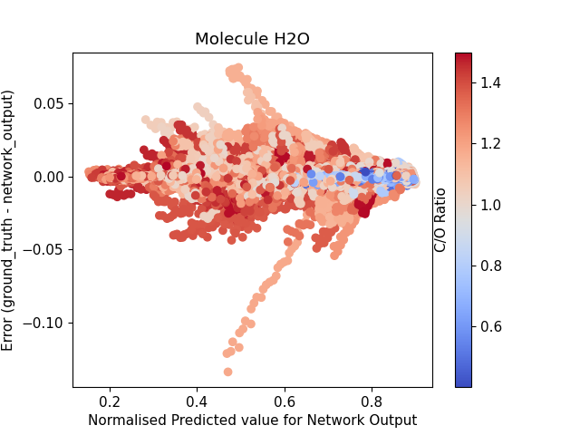
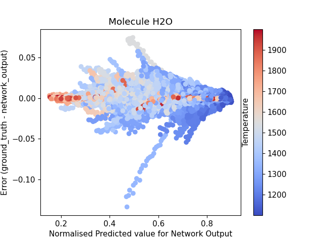
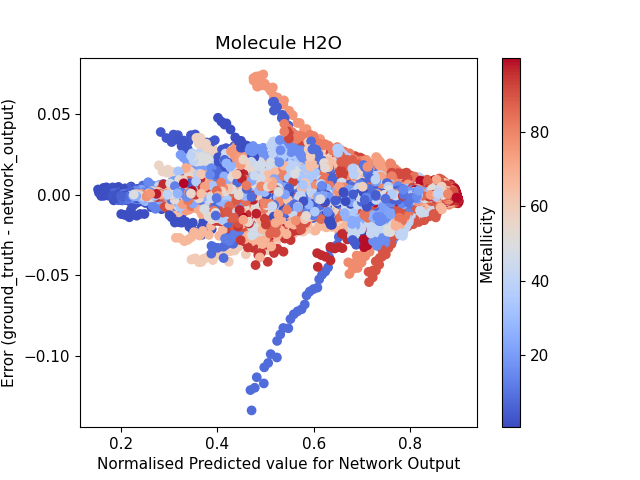

# EVALUATION EXAMPLE

The notebook contains an example of a network evaluation code. Due to size restrictions, not all plots are displayed.

# SOME INTERESTING FIGURES

| C/O Ratio | Temperature | Metallicity |
|-----------|-------------|-------------|
|  |  |  |

Figure 1: Distribution of predicted values for molecule CO2 in all layers vs error calculated by network_prediction - ground truth, coloured by C/O ratio, Temperature and Metallicity.

| C/O Ratio | Temperature | Metallicity |
|-----------|-------------|-------------|
|  |  |  |

Figure 2: Distribution of predicted values for molecule CH3 in all layers vs error calculated by network_prediction - ground truth, coloured by C/O ratio, Temperature and Metallicity.

| C/O Ratio | Temperature | Metallicity |
|-----------|-------------|-------------|
|  |  |  |

Figure 3: Distribution of predicted values for molecule H2O in all layers vs error calculated by network_prediction - ground truth, coloured by C/O ratio, Temperature and Metallicity.

