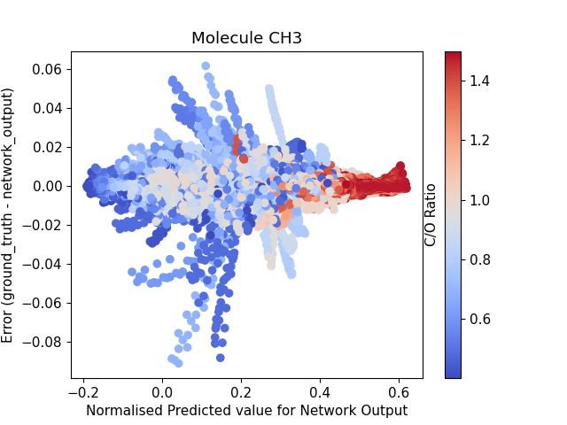
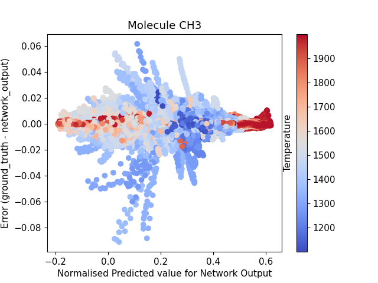

# EVALUATION EXAMPLE

The notebook contains an example of a network evaluation code. Due to size restrictions, not all plots are displayed.

# SOME INTERESTING FIGURES

[Initial Parameters](figures/initial_parameters_CHEXANET.png)

Figure 1: Pair plots illustrating the distribution of initial exoplanetary parameters: C/O ratio, Temperature (K), Metallicity, and Planet Mass (M_J), colour-coded by the Mean Absolute Error (MAE) for Model D. Although the prediction performance is good, it is still noticeable that there is a cluster formation and a peak in MAE around a C/O ratio of 1.0 in the Temperature vs. C/O ratio plot, which suggests a possible area of increased predictive difficulty. A slight pattern is also observed for temperatures around 1500K and planets with a small radius under the temperature of 1500K.

[Error vs Temperature](figures/MAE_vs_Temperature_COratio_color_ModelD.png)

Figure 2: Comparative visualisation of MAE against Isothermal Temperature for D coloured by Carbon-to-Oxygen (C/O) Ratio. 

[Error vs Temperature](figures/MAE_vs_Temperature_Mass_color_ModelD.png)

Figure 3: Comparative visualisation of MAE against Isothermal Temperature for D coloured by Planet Mass.

| C/O Ratio | Temperature | Metallicity |
|-----------|-------------|-------------|
|  |  |  |

Figure 4: Distribution of predicted values for molecule CO2 in all layers vs error calculated by network_prediction - ground truth, coloured by C/O ratio, Temperature and Metallicity.

| C/O Ratio | Temperature | Metallicity |
|-----------|-------------|-------------|
|  |  |  |

Figure 5: Distribution of predicted values for molecule CH3 in all layers vs error calculated by network_prediction - ground truth, coloured by C/O ratio, Temperature and Metallicity.

| C/O Ratio | Temperature | Metallicity |
|-----------|-------------|-------------|
|  |  |  |

Figure6: Distribution of predicted values for molecule H2O in all layers vs error calculated by network_prediction - ground truth, coloured by C/O ratio, Temperature and Metallicity.

