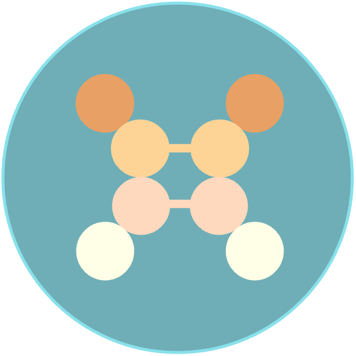

<table border="0" style="width: 100%; border-collapse: collapse;">
  <tr>
    <td style="width: 50px; vertical-align: top;">
      
    </td>
    <td>
      <h1 style="margin-top: 0;">CHEXANET: A Novel Approach to Fast-Tracking Disequilibrium Chemistry Calculations for Exoplanets Using Neural Networks</h1>
    </td>
  </tr>
</table>

  We introduce CHEXANET, an advanced neural network architecture tailored for fast and accurate simulations of disequilibrium chemistry in exoplanetary atmospheres. Traditional approaches to modeling these atmospheres have been limited by computational constraints and the complexity of accurately simulating disequilibrium chemical processes. CHEXANET addresses these challenges by employing a U-Net-based architecture that enhances the efficiency of these calculations.

